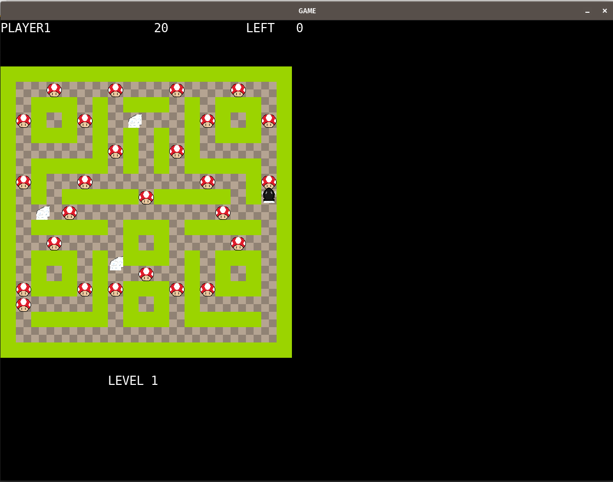
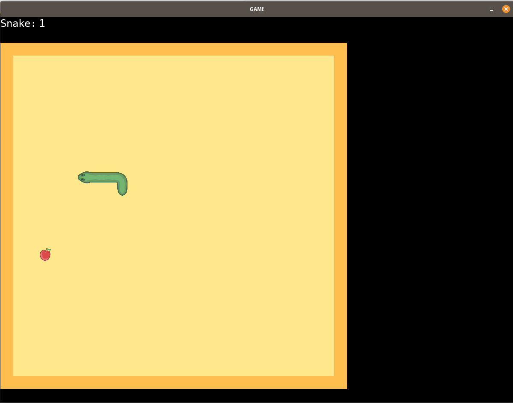
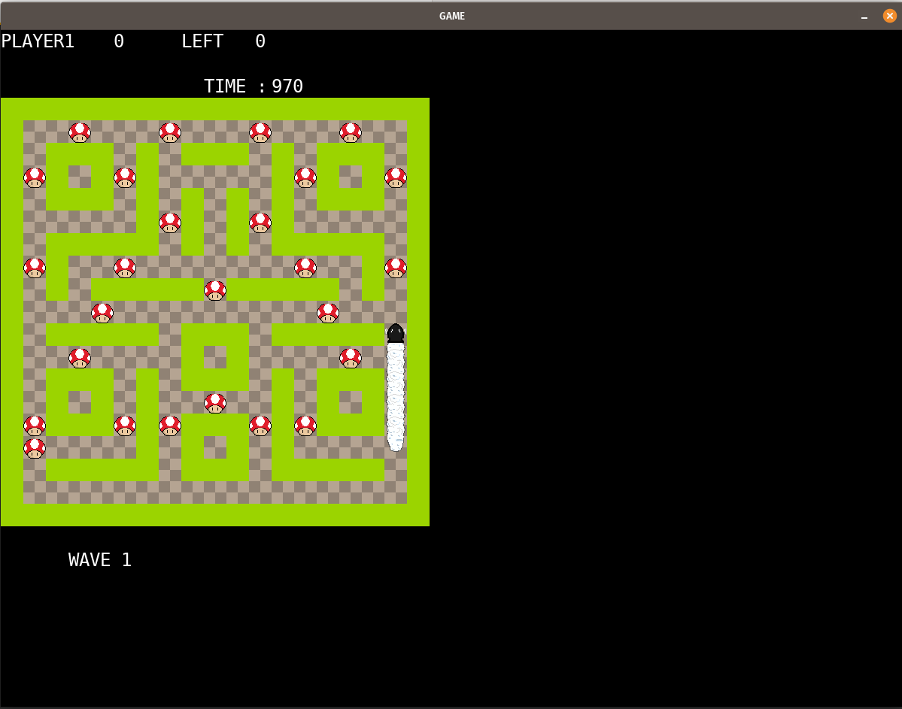
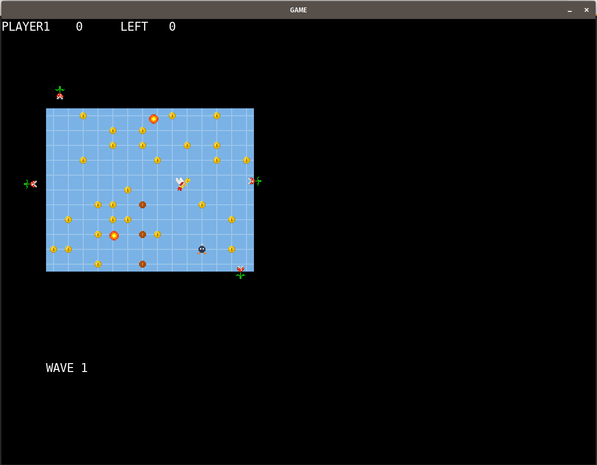
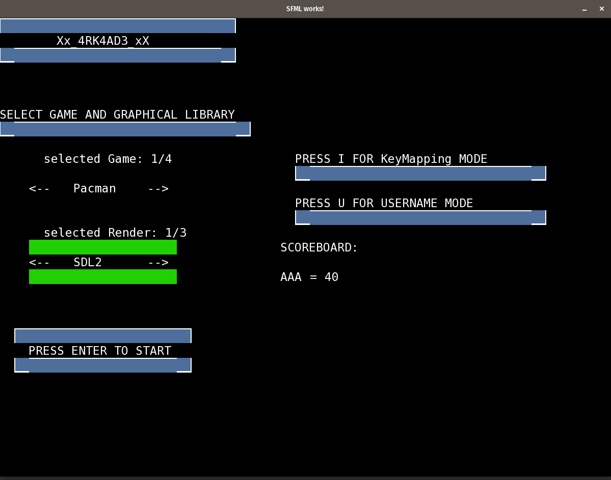

# arcade

This project is a C++ program whose goal was to be able to play retro games like Pac Man, or Snake while being able to dynamically switch graphic library during a game.
The Program currently supports 4 games : Snake, Nibbler, Pac-Man and Solar Fox, and 4 graphic libraries : SDL2, SFML and Ncurses


## Installation

### SDL2 installation

```
sudo apt-get install libsdl2-dev
```

if this doesn't work, I encourage you to consult the [complete instructions](https://wiki.libsdl.org/SDL2/Installation)

You then have to install the SDL2-Image and SDL2-TTF extensions
```
sudo apt install libsdl2-image-dev
sudo apt-get install libsdl2-ttf-dev
```

### SFML installation

```
sudo apt-get install libsfml-dev
```
Same thing here, if this doesn't work, here's the [complete guide ](https://www.sfml-dev.org/tutorials/2.6/start-linux.php)

### Ncurses installation
```
sudo apt-get install libncurses5-dev libncursesw5-dev
```

That's all, you're now ready to go.
## Usage/Examples

### Create the binary
```bash
cd arcade
make
```


### Execute the binary
In order to execute the binary, you have to pass as an argument the path to the first graphical library. All of the graphical libraries and the games are located in the ./lib/ directory at the root of the project
```
./arcade [PATH]

# exemple : ./arcade lib/arcade_sfml.so
```

### In-game commands

At all times when playing, you can press several keys :
- **M** to change game
- **L** to change graphical library
- **Q** to quit the game
- **R** to restart the game

In the menu you can press :
- **I** to access the keymapping mode
- **U** to set or change the username
- **LEFT, RIGHT, TOP, DOWN** : navigate through the options

## Game rules and commands

### Pac man

Your goal is to eat all fruits in the level. You are the rocket and are able to move in all 4 directions if you're not blocked.
You have 4 enemies whose goal is to catch you.
They all have different AI behaviour.

**Commands** :
- **LEFT, RIGHT, TOP, DOWN** : move the character

### Snake

You gain points by eating the fruits in the level. If you ever bite your own tail, you lose. Each time you eat a fruit, your snake length is increased by 1

**Commands** :
- **LEFT, RIGHT, TOP, DOWN** : move the character

### Nibbler

This game is similar to the snake, because you are a snake who needs to eat all fruits in the level and whose size increases by 1 for each fruit eaten. But in the nibbler, there are obstacles in the map and you have a time limit for each level.

**Commands** :
- **LEFT, RIGHT, TOP, DOWN** : move the character

### SolarFox

In this game, you are placed in a board with multiple tiles. Your goal is to hit all coins with your hammer while dodging enemies' projectiles and the mines on certain tiles.
You can destroy enemies' projectiles with your hammer.

**Commands** :
- **LEFT, RIGHT, TOP, DOWN** : move the character
- **A** : throw hammer

## Authors

- [@501stEcho](https://github.com/501stEcho)
- [@MathiDEV](https://github.com/MathiDEV)
- [@vavarier](https://github.com/vavarier)


## Screenshots




